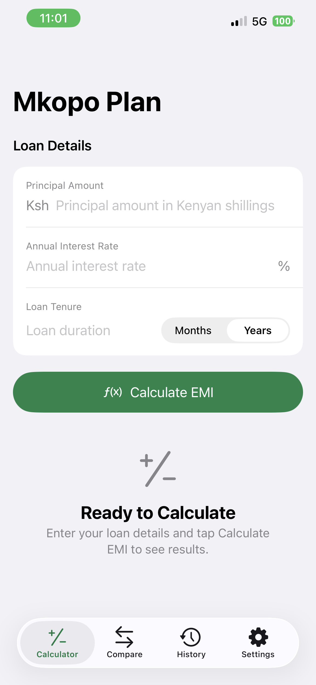
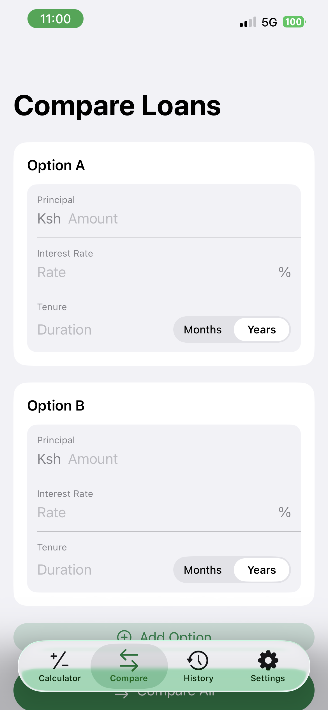
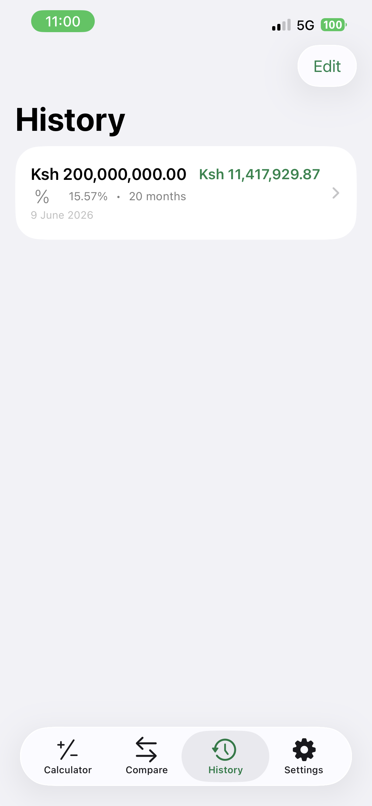
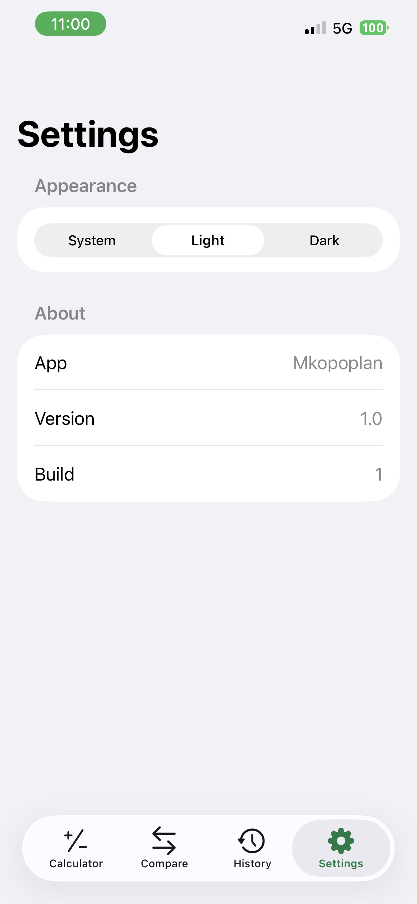

# Mkopo Plan

A SwiftUI loan calculator and amortization app built with MVVM and SwiftData. Enter a loan amount, interest rate, and tenure to get monthly EMI, total interest, a full repayment schedule, and saved calculation history.

<p align="center">
  
</p>

## Screenshots

| Calculator | Compare |
|:---:|:---:|
|  |  |

| History | Settings |
|:---:|:---:|
|  |  |

## Requirements

- macOS with **Xcode 26.1** or later
- iOS **26.1** simulator or physical device
- Apple Developer account (for running on a real device)

## How to Run

1. Clone the repository and open the project in Xcode:

   ```bash
   git clone <repository-url>
   cd mkopoplan
   open mkopoplan.xcodeproj
   ```

2. Select the **mkopoplan** scheme and choose a simulator (e.g. iPhone 17) or your connected device.

3. Press **⌘R** to build and run.

### Run unit tests

```bash
xcodebuild -scheme mkopoplan \
  -destination 'platform=iOS Simulator,name=iPhone 17' \
  test -only-testing:mkopoplanTests
```

Or in Xcode: **⌘U**.

## Architecture Overview

The app follows **MVVM** with a thin persistence layer and a dedicated calculation service.

```
mkopoplan/
├── Models/           # LoanInput, LoanResult, AmortizationEntry, SwiftData entities
├── Services/         # LoanCalculatorService (EMI + amortization logic)
├── ViewModels/       # @Observable view models, cached results
├── Views/            # SwiftUI screens and reusable components
├── Persistence/      # SwiftData repository + ModelContainer setup
└── Utilities/        # Validation, currency formatting, theming
```

**Data flow**

1. The user enters loan details in `LoanCalculatorView`.
2. `LoanCalculatorViewModel` validates input via `LoanInputValidator`.
3. `LoanCalculatorService` computes EMI and builds the amortization schedule using `Decimal` arithmetic.
4. Results are shown in the UI; the user can save them through `SavedCalculationRepository` (SwiftData).
5. Saved loans appear in `HistoryView` and can be reopened in the calculator.

**Key design choices**

- Calculation logic lives in `LoanCalculatorService`, not in views or view models, so it stays testable and reusable (e.g. loan comparison uses the same service).
- Amortization schedules are generated once per calculation and cached in `LoanResult` to avoid redundant work on navigation.
- SwiftData stores summary fields only (principal, rate, tenure, EMI, totals, date) — not the full schedule. Schedules are regenerated when a saved item is opened.

## Assumptions

| Area | Assumption |
|------|------------|
| Currency | Amounts are in **Kenyan Shillings (KES)** with `en_KE` locale formatting. |
| Repayment | Fixed monthly EMI using the standard reducing-balance formula. |
| Interest | Annual rate entered as a percentage; converted to a monthly rate internally. |
| Tenure | User enters months or years; all calculations use months (max **360**). |
| Zero interest | EMI = principal ÷ months; no interest portion in the schedule. |
| Payments | One payment per month; no fees, penalties, or grace periods. |
| Persistence | One saved record per user action; no cloud sync or export. |
| Comparison | Up to three loan options; lowest EMI is highlighted after comparison. |

## Trade-offs and Limitations

**What works well**

- `Decimal` is used for money calculations instead of `Double`, which reduces floating-point drift on long tenures.
- `List` backs the amortization table for efficient scrolling up to 360 rows.
- Input validation runs before any calculation; errors are shown inline.
- If disk storage fails on launch, the app falls back to in-memory SwiftData and shows a warning rather than crashing.

**Known limitations**

- **No schedule persistence** — reopening a saved loan regenerates the amortization table from stored inputs. This keeps the database small but means saved EMI must match recalculated EMI for consistency.
- **KES only** — currency is fixed to Kenyan Shillings. Multi-currency support would need a settings picker and formatter changes.
- **No extra costs** — processing fees, insurance, or balloon payments are not modelled.
- **Rounding** — amounts are rounded to two decimal places (banker's rounding). The final payment is adjusted so the balance reaches zero.
- **Comparison is manual** — users tap "Compare All"; there is no live update as they type.
- **iOS 26.1 minimum** — targets the latest SDK; not tested on older iOS versions.

## Features

- Loan EMI calculator with principal vs interest chart
- Full amortization schedule
- Save and revisit past calculations
- Side-by-side loan comparison (2–3 options)
- Light / dark / system theme
- VoiceOver labels and Dynamic Type-friendly text styles
- Keyboard Done button and dismiss-on-tab-switch


